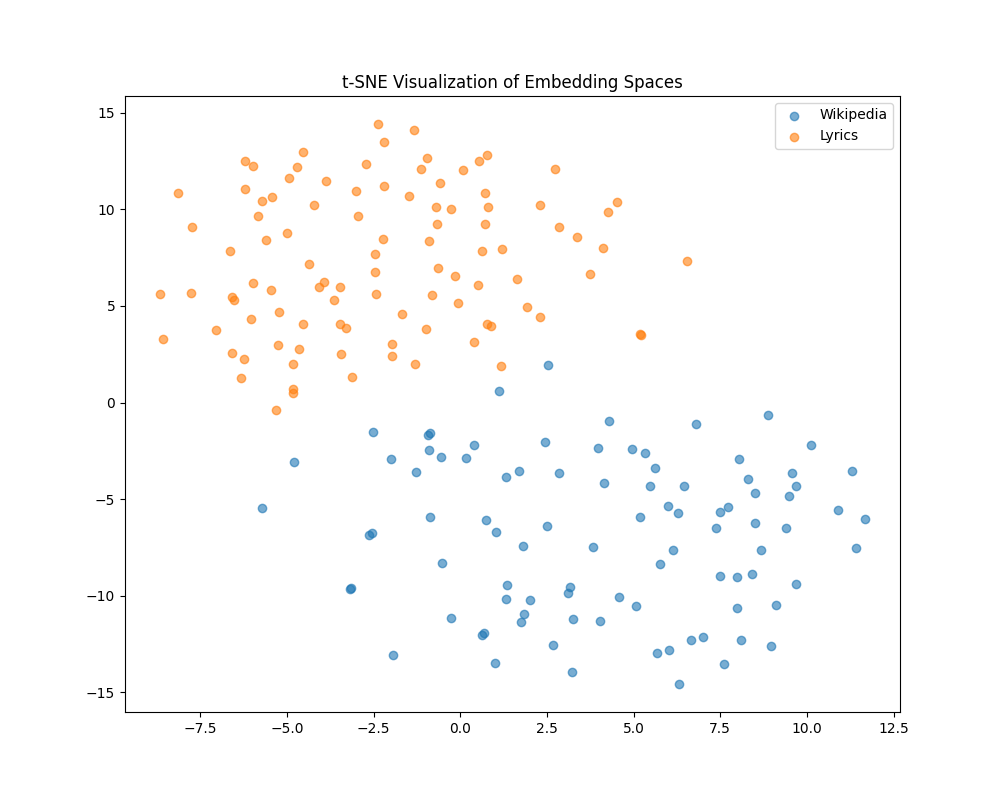

# Research and Documentation

## Initial Ideas

In the beginning, my main idea was to do something with embeddings. A spatial representation of data just seemed interesting to me, and I wanted to have a go at this myself and pack it into a creative project. I searched for data that is widely available and easy to process. Wikipedia articles were the first thing that came to my mind. I quickly searched the web and found a Python package to retrieve them easily.

Now I needed something that I could compare the articles with. Nothing really came to my mind at first, but a few days later, I had the idea to match songs to Wikipedia articles.

## Getting the Embeddings

### Initial Approach
My main goal for this project was to let the algorithm do all the matching itself, without interference from a human. So, I needed methods that required no labeling. Additionally, I wanted to use as many existing technologies as possible because the project seemed ambitious for a 3-credit module.

With those goals in mind, the only really effective way to compare songs to articles was via the lyrics. To create a good matching algorithm, the embeddings needed to be as homogeneous as possible. This means the content of both texts should be as similar as possible before it gets converted to an embedding.

I started off by trying to summarize the lyrics within 5 sentences using Gemini. For the Wikipedia articles, I already had a summary from the top of each page.

This is what a prompt to the LLM looked like:

    "Here are some lyrics from the song "
    + title
    + " by "
    + artist
    + ". Write me a summary of the song. Dont try to interpret the lyrics, just summarize them. Dont speak about the lyrics being in a song and refer to the author as 'A person'. Take the lyrics and just assume that they are true. Do it with 5 sentences and only return the summarized text:\n"
    + lyrics,

Now I plug the result into a pretrained Sentence-BERT, sum the embedding of each sentence, and normalize them. This is my final embedding of the 5 sentences.

To check if the Wikipedia and lyrics embeddings are close by, I decided to use a dimensionality reduction method called TSNE so I could plot them in a 2D space. When I tested it with a random selection of songs and Wikipedia articles, the result was rather humbling:

I played around a lot with the prompt and got similar results:

### Keywords to the Rescue

Clearly, a new approach was needed. I didn't want to change the whole pipeline, though, because I had already spent a lot of time researching and building pipelines. My research led me to a [Paper](https://sol.sbc.org.br/index.php/eniac/article/view/12155) hat did "Temporal Analysis and Visualization of Music." Inspired by this paper, I gave the keyword-based approach a go. Also, I used their dataset, which already has lemmatized lyrics of about 25,000 songs, so no more lyrics scraping on websites was required.

Since I didn't want to copy their method entirely, I chose to go for another keyword extraction method and stumbled upon YAKE. Now I switched back to a regular BERT model and summed the embeddings of the top 10 keywords, normalizing them as well. This resulted in the following TSNE plot:

While this doesn't look perfect, there definitely is more overlap between the embeddings. Without any other idea on how to improve my method, I decided to scale it to all 25,000 songs in my dataset. My intuition was that with a bigger sample size, we would have more individual songs that appear in the Wikipedia embeddings group.

To visualize the final results, I added an interactive file called `tsne_plot.html` 

## Matching
The final matching is rather easy. We only need a good metric to tell us which lyrics embedding is closest to our desired Wikipedia embedding. The main contenders are Euclidean distance and cosine similarity. I chose to go for cosine similarity because it seems to be the standard.

To do the matching, I actually use a vector database called Pinecone. Pinecone is not only used to store all my 25,000 lyrics embeddings, but you can also query for an embedding and get the top k closest to the specified embedding. This basically gets the job done for the matching part.

## Gussing Game

Thanks to the questioning of Laura at my final presentation, I decided to create a super simple guessing game where you try to outmatch the "AI" and find a more suitable song for a random Wikipedia article. You can find more about that on the installation and game tab.
